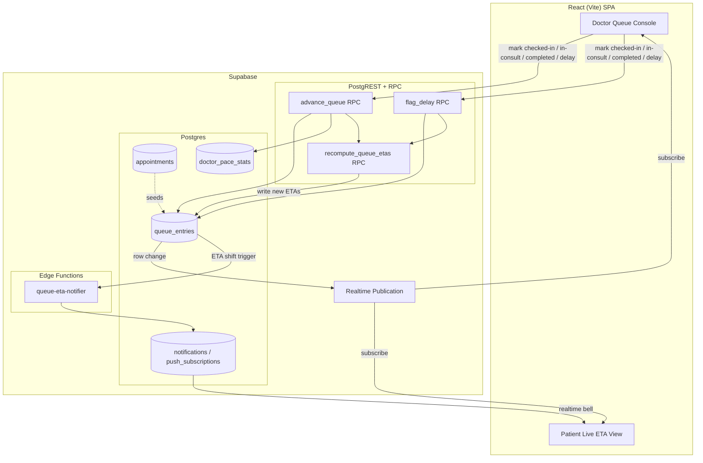
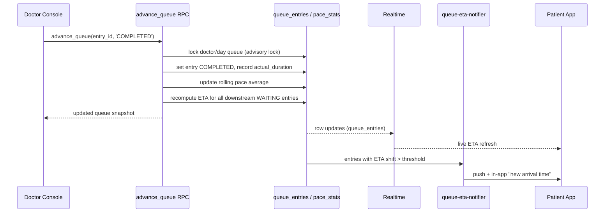
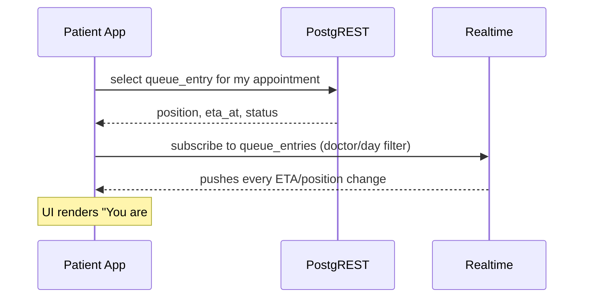

# Design Document: Live Queue ETA (Dynamic Queue Tokenization)

## Overview

Standard booking systems hand patients a static slot time (e.g. 10:00 AM). When a
doctor is delayed by an emergency, everyone still shows up on the printed schedule
and the waiting room overflows. Live Queue ETA gives each patient an "Uber-style"
live estimate of when they will actually be seen, computed from the doctor's *actual*
consultation pace rather than the theoretical slot grid.

The feature layers on top of MediBook's existing slot-based `appointments` table. For
each doctor/day it derives a live queue ordered by slot time, tracks per-appointment
lifecycle beyond the coarse `PENDING/CONFIRMED/CANCELLED/COMPLETED` model (checked-in,
in-consultation, completed, delay), and recomputes downstream ETAs whenever the doctor
advances the queue or flags a delay. When a patient's ETA shifts beyond a configurable
threshold, the system reuses the existing notifications + push infrastructure to tell
them the new suggested arrival/leave-home time. Patients watch their ETA update in real
time through Supabase Realtime, exactly as it already works for the notification bell.

The design reuses existing infrastructure everywhere possible: the `appointments` status
model, the `notifications` / `push_subscriptions` tables, Supabase Realtime publication,
Edge Functions for privileged recompute, and the migration-017 concurrency patterns
(atomic RPCs, advisory locks) to keep queue advancement race-safe.

## Architecture



The queue is a **projection** of `appointments` for a single doctor/day, materialized
in a `queue_entries` table so ETAs can be persisted, indexed, streamed over Realtime,
and read cheaply by patients without recomputing on every client. The `appointments`
table remains the source of truth for *who* is booked; `queue_entries` owns the live
*ordering, lifecycle state, and ETA*.

## Sequence Diagrams

### Doctor advances the queue (completes a patient)



### Patient watches live ETA



## Components and Interfaces

### Component 1: Queue Projection Service (DB + RPC layer)

**Purpose**: Owns the live queue for each doctor/day and keeps ETAs consistent.

**Interface** (Postgres RPCs, called from the SPA via `supabase.rpc`):
```ts
// Ensure a queue_entries row exists for every active appointment for a doctor/day.
// Idempotent; safe to call on view open.
seed_queue(p_doctor_id: bigint, p_date: date): QueueEntry[]

// Doctor advances one entry's lifecycle. Recomputes downstream ETAs atomically.
advance_queue(p_entry_id: bigint, p_next_state: QueueState): QueueEntry[]

// Doctor flags a delay (e.g. emergency) of N minutes affecting the rest of the day.
flag_delay(p_doctor_id: bigint, p_date: date, p_delay_minutes: int, p_reason: text): QueueEntry[]

// Pure recompute of ETAs from current pace + queue order. Called internally by the
// two mutators above; exposed for admin/debug.
recompute_queue_etas(p_doctor_id: bigint, p_date: date): QueueEntry[]
```

**Responsibilities**:
- Project active appointments into ordered `queue_entries`.
- Maintain each entry's lifecycle state and timestamps.
- Recompute `eta_at` and `position` for all waiting entries after any change.
- Serialize concurrent doctor actions per doctor/day via advisory locks.

### Component 2: Pace Estimator

**Purpose**: Turns the doctor's recent completed consultations into a live "minutes per
patient" estimate used to project ETAs.

**Interface**:
```ts
// Rolling average of the last N actual consultation durations for a doctor (today).
// Falls back to the slot duration when there is not enough history.
estimate_pace(p_doctor_id: bigint, p_date: date): { avg_minutes: number, sample_size: number }
```

**Responsibilities**:
- Record `actual_duration_minutes` when an entry is completed.
- Compute a rolling average over the most recent `PACE_WINDOW` completions.
- Provide a sensible fallback (booked slot duration) on cold start.

### Component 3: Doctor Queue Console (React)

**Purpose**: Doctor-facing control panel to advance the queue and flag delays.

**Interface**:
```ts
interface DoctorQueueConsoleProps {
  doctorId: number
  date: string // yyyy-mm-dd
}

// Service module (src/services/queue.js)
function subscribeToQueue(doctorId: number, date: string, onChange: (q: QueueEntry[]) => void): Unsubscribe
function markCheckedIn(entryId: number): Promise<QueueEntry[]>
function startConsultation(entryId: number): Promise<QueueEntry[]>
function completeConsultation(entryId: number): Promise<QueueEntry[]>
function flagDelay(doctorId: number, date: string, minutes: number, reason: string): Promise<QueueEntry[]>
```

**Responsibilities**:
- Render the ordered queue with each patient's current state.
- Provide one-tap lifecycle controls and a delay dialog.
- Subscribe to Realtime so multiple devices stay in sync.

### Component 4: Patient Live ETA View (React)

**Purpose**: The Uber-style live estimate a patient sees for their appointment.

**Interface**:
```ts
interface PatientEtaViewProps {
  appointmentId: number
}

// Service module (src/services/queue.js)
function getMyQueueEntry(appointmentId: number): Promise<QueueEntry | null>
function subscribeToMyEntry(appointmentId: number, onChange: (e: QueueEntry) => void): Unsubscribe
```

**Responsibilities**:
- Show live position, estimated wait, ETA timestamp, and suggested leave-home time.
- Update in real time from Realtime pushes.
- Surface delay banners when the doctor flags an emergency.

### Component 5: queue-eta-notifier (Edge Function)

**Purpose**: Sends push + in-app notifications when a patient's ETA shifts materially.

**Interface**:
```ts
// POST body: { doctorId: number, date: string, shifts: EtaShift[] }
// where EtaShift = { entryId, patientId, oldEtaAt, newEtaAt, deltaMinutes }
async function handleEtaShifts(req: Request): Promise<Response>
```

**Responsibilities**:
- Filter shifts whose `|deltaMinutes|` exceeds `NOTIFY_THRESHOLD_MINUTES`.
- Respect `notification_preferences` (push_enabled) per patient.
- Write an in-app `notifications` row (type `QUEUE_ETA_SHIFT`) and dispatch web push.
- Debounce so a patient is not spammed for rapid successive small shifts.

## Data Models

### Model 1: queue_entries

```sql
queue_entries (
  id                       BIGINT IDENTITY PRIMARY KEY,
  appointment_id           BIGINT UNIQUE NOT NULL REFERENCES appointments(id) ON DELETE CASCADE,
  doctor_id                BIGINT NOT NULL REFERENCES doctors(id) ON DELETE CASCADE,
  patient_id               UUID   NOT NULL REFERENCES profiles(id) ON DELETE CASCADE,
  queue_date               DATE   NOT NULL,
  scheduled_start_time     TIME   NOT NULL,        -- from the appointment slot
  position                 INT    NOT NULL,        -- 1-based live order among active
  state                    TEXT   NOT NULL DEFAULT 'WAITING'
                             CHECK (state IN ('WAITING','CHECKED_IN','IN_CONSULTATION','COMPLETED','SKIPPED')),
  eta_at                   TIMESTAMPTZ,            -- projected time patient will be seen
  suggested_leave_at       TIMESTAMPTZ,            -- eta_at minus travel buffer
  consult_started_at       TIMESTAMPTZ,
  consult_completed_at     TIMESTAMPTZ,
  actual_duration_minutes  INT,                    -- filled on completion
  last_notified_eta_at     TIMESTAMPTZ,            -- for shift-threshold debounce
  created_at               TIMESTAMPTZ NOT NULL DEFAULT NOW(),
  updated_at               TIMESTAMPTZ NOT NULL DEFAULT NOW()
)
```

**Validation Rules**:
- Exactly one queue entry per appointment (`UNIQUE(appointment_id)`).
- `position` is unique per `(doctor_id, queue_date)` among non-terminal states.
- At most one entry per `(doctor_id, queue_date)` may be `IN_CONSULTATION`.
- `state` transitions must follow the allowed lifecycle (see Correctness Properties).
- `actual_duration_minutes > 0` when set.

### Model 2: doctor_pace_stats

```sql
doctor_pace_stats (
  id                     BIGINT IDENTITY PRIMARY KEY,
  doctor_id              BIGINT NOT NULL REFERENCES doctors(id) ON DELETE CASCADE,
  stat_date              DATE   NOT NULL,
  rolling_avg_minutes    NUMERIC(6,2) NOT NULL,   -- current pace estimate
  sample_size            INT    NOT NULL DEFAULT 0,
  manual_delay_minutes   INT    NOT NULL DEFAULT 0, -- cumulative from flag_delay
  updated_at             TIMESTAMPTZ NOT NULL DEFAULT NOW(),
  CONSTRAINT uq_pace_doctor_day UNIQUE (doctor_id, stat_date)
)
```

**Validation Rules**:
- `rolling_avg_minutes > 0`.
- `sample_size >= 0`.
- One row per `(doctor_id, stat_date)`.

### Model 3: QueueEntry (client type)

```ts
type QueueState = 'WAITING' | 'CHECKED_IN' | 'IN_CONSULTATION' | 'COMPLETED' | 'SKIPPED'

interface QueueEntry {
  id: number
  appointmentId: number
  doctorId: number
  patientId: string
  queueDate: string          // yyyy-mm-dd
  scheduledStartTime: string // HH:mm
  position: number
  state: QueueState
  etaAt: string | null       // ISO timestamp
  suggestedLeaveAt: string | null
  actualDurationMinutes: number | null
}
```

### Configuration Constants

```ts
const PACE_WINDOW = 5              // number of recent completions in the rolling average
const NOTIFY_THRESHOLD_MINUTES = 15 // notify only when ETA moves at least this much
const TRAVEL_BUFFER_MINUTES = 20    // default subtracted from ETA for "leave by" time
const NOTIFY_DEBOUNCE_MINUTES = 5   // min gap between ETA notifications per patient
```

## Algorithmic Pseudocode

### ETA recomputation

```pascal
ALGORITHM recomputeQueueEtas(doctorId, date)
INPUT:  doctorId, date
OUTPUT: updated list of queue entries with fresh eta_at / position
BEGIN
  ASSERT holdsAdvisoryLock(doctorId, date)   // serialized per doctor/day

  pace ← estimatePace(doctorId, date)        // { avgMinutes, sampleSize }
  delay ← paceStats(doctorId, date).manualDelayMinutes

  // Anchor: when does the NEXT patient actually start?
  active ← entryInState(doctorId, date, 'IN_CONSULTATION')
  IF active ≠ NULL THEN
    // remaining time for the in-progress consult
    elapsed ← now() - active.consult_started_at
    cursor ← now() + MAX(0, pace.avgMinutes - elapsed)
  ELSE
    cursor ← MAX(now(), earliestScheduledStart(doctorId, date)) + delay
  END IF

  waiting ← entriesInStates(doctorId, date, ['CHECKED_IN','WAITING'])
             ORDERED BY scheduled_start_time ASC

  pos ← positionOfActiveOrOne(active)
  FOR each entry IN waiting DO
    ASSERT cursor >= now() - 1_minute   // ETAs never drift into the past

    // A patient is never projected earlier than their booked slot.
    entryEta ← MAX(cursor, slotDateTime(date, entry.scheduled_start_time))
    entry.eta_at ← entryEta
    entry.suggested_leave_at ← entryEta - TRAVEL_BUFFER_MINUTES
    pos ← pos + 1
    entry.position ← pos

    cursor ← entryEta + pace.avgMinutes
  END FOR

  persist(waiting)
  RETURN currentQueue(doctorId, date)
END
```

**Preconditions**:
- Caller holds the per-doctor/day advisory lock.
- `pace.avgMinutes > 0` (guaranteed by `estimatePace` fallback).

**Postconditions**:
- Every non-terminal entry has a non-null `eta_at >= now() - tolerance`.
- ETAs are monotonically non-decreasing by queue position.
- No waiting entry is projected before its booked slot start.

**Loop Invariants**:
- `cursor` holds the projected free time of the doctor after all entries processed so far.
- `pos` equals the number of entries ordered at or before the current one.

### Advance queue (lifecycle transition + recompute)

```pascal
ALGORITHM advanceQueue(entryId, nextState)
INPUT:  entryId, nextState ∈ QueueState
OUTPUT: updated queue snapshot
BEGIN
  entry ← loadEntry(entryId)
  ASSERT callerIsOwningDoctor(entry.doctor_id)     // RLS + explicit check
  ASSERT isValidTransition(entry.state, nextState) // see state machine

  acquireAdvisoryLock(entry.doctor_id, entry.queue_date)

  IF nextState = 'IN_CONSULTATION' THEN
    ASSERT noOtherInConsultation(entry.doctor_id, entry.queue_date)
    entry.consult_started_at ← now()
  ELSE IF nextState = 'COMPLETED' THEN
    entry.consult_completed_at ← now()
    entry.actual_duration_minutes ←
        durationMinutes(entry.consult_started_at, now())
    updateRollingPace(entry.doctor_id, entry.queue_date,
                      entry.actual_duration_minutes)
  END IF

  entry.state ← nextState
  persist(entry)

  queue ← recomputeQueueEtas(entry.doctor_id, entry.queue_date)
  emitEtaShiftEvents(queue)   // async → queue-eta-notifier
  RETURN queue
  // advisory lock released at transaction end
END
```

**Preconditions**:
- `entry` exists and belongs to a doctor owned by the caller.
- `(entry.state → nextState)` is a legal transition.

**Postconditions**:
- Entry persisted in `nextState` with the right timestamps.
- On completion, pace stats reflect the new sample.
- All downstream ETAs recomputed; shift events emitted.

### Rolling pace update

```pascal
ALGORITHM updateRollingPace(doctorId, date, newDuration)
INPUT:  doctorId, date, newDuration (minutes, > 0)
OUTPUT: none (persists doctor_pace_stats)
BEGIN
  recent ← lastNDurations(doctorId, date, PACE_WINDOW)  // includes newDuration
  avg ← SUM(recent) / COUNT(recent)
  upsertPaceStats(doctorId, date,
                  rolling_avg_minutes := avg,
                  sample_size := COUNT(recent))
END
```

**Preconditions**: `newDuration > 0`.
**Postconditions**: `rolling_avg_minutes` equals the mean of up to the last `PACE_WINDOW` completions; `sample_size` in `[1, PACE_WINDOW]`.

### ETA shift notification decision

```pascal
ALGORITHM emitEtaShiftEvents(queue)
INPUT:  queue (entries with fresh eta_at)
OUTPUT: list of shifts worth notifying
BEGIN
  shifts ← []
  FOR each entry IN queue WHERE state IN ['WAITING','CHECKED_IN'] DO
    prev ← entry.last_notified_eta_at
    IF prev = NULL THEN CONTINUE   // first ETA is shown, not pushed
    delta ← ABS(minutesBetween(prev, entry.eta_at))
    recentlyNotified ← minutesBetween(entry.updated_at, now()) < NOTIFY_DEBOUNCE_MINUTES
    IF delta >= NOTIFY_THRESHOLD_MINUTES AND NOT recentlyNotified THEN
      shifts.append({ entryId: entry.id, patientId: entry.patient_id,
                      oldEtaAt: prev, newEtaAt: entry.eta_at, deltaMinutes: delta })
      entry.last_notified_eta_at ← entry.eta_at
    END IF
  END FOR
  IF shifts NOT EMPTY THEN dispatchToNotifier(shifts)
  RETURN shifts
END
```

**Preconditions**: queue entries have up-to-date `eta_at`.
**Postconditions**: only shifts exceeding the threshold and outside the debounce window are dispatched; `last_notified_eta_at` advanced for each notified entry.

**Loop Invariant**: every entry examined so far has either been queued for notification (and its `last_notified_eta_at` updated) or intentionally skipped.

## Key Functions with Formal Specifications

### Function: estimatePace()

```ts
function estimatePace(doctorId: number, date: string): { avgMinutes: number; sampleSize: number }
```

**Preconditions**:
- `doctorId` references an existing doctor.

**Postconditions**:
- Returns `avgMinutes > 0` always (fallback to the doctor's booked slot duration, else 30).
- `sampleSize` equals the count of completed consultations used (0 when falling back).
- No mutation of any table (pure read).

**Loop Invariants**: N/A.

### Function: isValidTransition()

```ts
function isValidTransition(from: QueueState, to: QueueState): boolean
```

**Preconditions**:
- `from` and `to` are valid `QueueState` values.

**Postconditions**:
- Returns `true` iff the pair is in the allowed transition set:
  `WAITING→CHECKED_IN`, `WAITING→SKIPPED`, `CHECKED_IN→IN_CONSULTATION`,
  `CHECKED_IN→SKIPPED`, `IN_CONSULTATION→COMPLETED`, `SKIPPED→WAITING`.
- No side effects.

## Example Usage

```ts
// ── Doctor console: advance the queue ──────────────────────────────
import {
  subscribeToQueue, markCheckedIn, startConsultation,
  completeConsultation, flagDelay,
} from '../../services/queue'

useEffect(() => {
  const unsub = subscribeToQueue(doctorId, today, setQueue)
  return unsub
}, [doctorId, today])

await markCheckedIn(entry.id)        // patient arrived
await startConsultation(entry.id)    // doctor begins
await completeConsultation(entry.id) // done → pace + downstream ETAs update
await flagDelay(doctorId, today, 45, 'Emergency surgery') // push everyone back 45 min

// ── Patient live ETA view ──────────────────────────────────────────
import { getMyQueueEntry, subscribeToMyEntry } from '../../services/queue'

const entry = await getMyQueueEntry(appointmentId)
// render: `You are #${entry.position} · ~${minsUntil(entry.etaAt)} min`
//         `Leave by ${fmt(entry.suggestedLeaveAt)}`
const unsub = subscribeToMyEntry(appointmentId, setEntry)
```

```ts
// ── queue service (src/services/queue.js) ──────────────────────────
export async function completeConsultation(entryId) {
  const { data, error } = await supabase.rpc('advance_queue', {
    p_entry_id: entryId,
    p_next_state: 'COMPLETED',
  })
  if (error) throw new Error(error.message || 'Could not update the queue.')
  return data
}

export function subscribeToMyEntry(appointmentId, onChange) {
  const channel = supabase
    .channel(`queue-entry-${appointmentId}`)
    .on('postgres_changes',
      { event: 'UPDATE', schema: 'public', table: 'queue_entries',
        filter: `appointment_id=eq.${appointmentId}` },
      payload => onChange(mapQueueEntry(payload.new)))
    .subscribe()
  return () => supabase.removeChannel(channel)
}
```

## Correctness Properties

Property 1: Single active consult — For every `(doctor_id, queue_date)`, at most one
entry is in state `IN_CONSULTATION` at any time.
`∀ d, day: |{ e : e.doctor_id=d ∧ e.queue_date=day ∧ e.state=IN_CONSULTATION }| ≤ 1`

Property 2: Legal transitions only — Every state change satisfies `isValidTransition`.
`∀ transition (from→to): isValidTransition(from, to)`

Property 3: ETA monotonicity — Within a doctor/day, ETAs increase with position.
`∀ e1, e2 (same doctor/day, non-terminal): e1.position < e2.position ⟹ e1.eta_at ≤ e2.eta_at`

Property 4: No past ETAs — A recomputed ETA is never before the current time (minus tolerance).
`∀ e (non-terminal): e.eta_at ≥ now() - tolerance`

Property 5: Never before booked slot — A patient is never projected earlier than their slot.
`∀ e: e.eta_at ≥ slotDateTime(e.queue_date, e.scheduled_start_time)`

Property 6: Delay shifts downstream — `flag_delay(d, day, m)` with `m > 0` never decreases
any waiting entry's ETA.
`∀ e (waiting): eta_after ≥ eta_before`

Property 7: Notification threshold — A push is emitted for an entry only if its ETA moved
at least `NOTIFY_THRESHOLD_MINUTES` since the last notified ETA.

Property 8: Pace bounds — `estimatePace` always returns `avgMinutes > 0`, even with no history.

Property 9: One entry per appointment — `∀ appointment a: |{ e : e.appointment_id=a.id }| ≤ 1`.

Property 10: Position bijection — Non-terminal entries for a doctor/day have contiguous,
unique positions starting at the active/next patient.

## Error Handling

### Scenario 1: Invalid state transition
**Condition**: Doctor attempts e.g. `WAITING → COMPLETED`.
**Response**: `advance_queue` raises `P0001` with a clear message; no state change.
**Recovery**: Console shows the error and refreshes the queue from Realtime.

### Scenario 2: Concurrent doctor actions (two devices)
**Condition**: Two tabs advance the queue simultaneously.
**Response**: Per-doctor/day advisory lock serializes them; the second recompute sees the
first's committed state.
**Recovery**: Both devices converge via Realtime; no lost updates.

### Scenario 3: Missing queue entry (view opened before seed)
**Condition**: Patient opens ETA view before `seed_queue` ran for the day.
**Response**: `getMyQueueEntry` returns `null`; UI calls `seed_queue` (idempotent) or shows
"Queue not started yet — your slot is at HH:mm".
**Recovery**: Entry appears once seeded; Realtime takes over.

### Scenario 4: Appointment cancelled mid-day
**Condition**: An appointment is cancelled after the queue is built.
**Response**: A trigger marks its entry `SKIPPED` (or deletes via cascade) and recomputes
downstream ETAs, pulling everyone earlier.
**Recovery**: Downstream patients get an earlier ETA; notified if shift exceeds threshold.

### Scenario 5: Notifier failure / offline patient
**Condition**: Web push endpoint is gone (410) or patient disabled push.
**Response**: In-app `notifications` row is still written; dead push subscriptions are
pruned; failures logged, not fatal to recompute.
**Recovery**: Patient sees the update via in-app bell / live view on next open.

### Scenario 6: Cold start pace (no completions yet)
**Condition**: First patient of the day not yet completed.
**Response**: `estimatePace` falls back to the booked slot duration (or 30 min).
**Recovery**: ETAs sharpen automatically as real completions accrue.

## Testing Strategy

### Unit Testing Approach
- `isValidTransition` — exhaustively test the allowed/disallowed transition matrix.
- `estimatePace` — cold start fallback, rolling window truncation at `PACE_WINDOW`,
  averaging correctness.
- ETA math helpers — `suggested_leave_at`, monotonic cursor advance, slot-floor clamp.
- Notification decision — threshold and debounce boundaries.

### Property-Based Testing Approach
Generate random queues (mix of states, slot times, random completion durations, random
delay flags) and assert the Correctness Properties hold after each `advance_queue` /
`flag_delay` / `recompute_queue_etas`:
- CP3 monotonicity, CP4 no-past, CP5 slot-floor, CP6 delay-non-decrease, CP1 single active.

**Property Test Library**: fast-check (matches the JS/Vitest stack already in the repo).

### Integration Testing Approach
- Migration applies cleanly and is idempotent (re-runnable).
- RLS: a patient can read only their own `queue_entries`; a doctor only their queue;
  admin can read all.
- End-to-end: seed → advance several patients → assert Realtime pushes and that a delay
  produces a `QUEUE_ETA_SHIFT` notification for affected patients above threshold.
- Concurrency: parallel `advance_queue` calls remain consistent under the advisory lock.

## Performance Considerations

- Recompute is O(n) in the number of waiting entries for one doctor/day (small, typically
  < 50), triggered only on doctor actions — not per client tick.
- Indexes: `(doctor_id, queue_date, position)` and `(appointment_id)` on `queue_entries`;
  `(doctor_id, stat_date)` unique on `doctor_pace_stats`.
- Realtime carries row diffs only; clients render from pushed rows, no polling.
- Notifier debounces to avoid push storms during rapid queue advancement.

## Security Considerations

- **RLS** mirrors existing patterns: patients `SELECT` their own entries
  (`patient_id = auth.uid()`), doctors access entries for doctors they own
  (`EXISTS (SELECT 1 FROM doctors WHERE id = doctor_id AND user_id = auth.uid())`),
  admins full access.
- Lifecycle mutators (`advance_queue`, `flag_delay`) are `SECURITY INVOKER` RPCs that
  re-verify the caller owns the doctor row — a patient cannot advance a queue.
- `recompute_queue_etas` writes only ETA/position, never identity or medical data.
- The Edge Function uses the service role only to write `notifications` and prune dead
  push subscriptions; it validates the caller and never exposes cross-patient data.
- No PII in Realtime payloads beyond what a patient may already see about their own entry.

## Dependencies

- **Existing**: `appointments`, `doctors`, `doctor_availability`, `profiles`,
  `notifications`, `push_subscriptions`, `notification_preferences`, `notification_logs`;
  Supabase Realtime publication; migration-017 concurrency helpers (advisory locks).
- **New DB objects**: `queue_entries`, `doctor_pace_stats`, RPCs `seed_queue`,
  `advance_queue`, `flag_delay`, `recompute_queue_etas`, `estimate_pace`; a trigger to
  keep entries in sync with appointment cancellations; Realtime publication entry for
  `queue_entries`.
- **New Edge Function**: `queue-eta-notifier`.
- **New client modules**: `src/services/queue.js`, a Doctor Queue Console page/component,
  and a Patient Live ETA view/component.
- **Libraries**: existing `web-push` usage in Edge Functions; `fast-check` for
  property-based tests (dev dependency).
